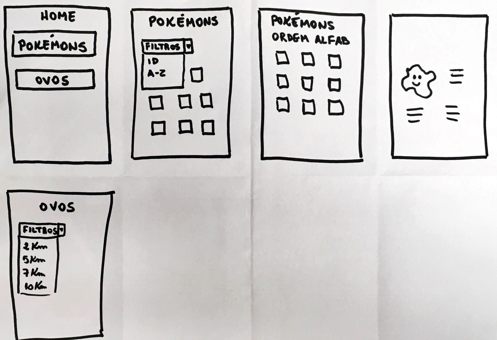
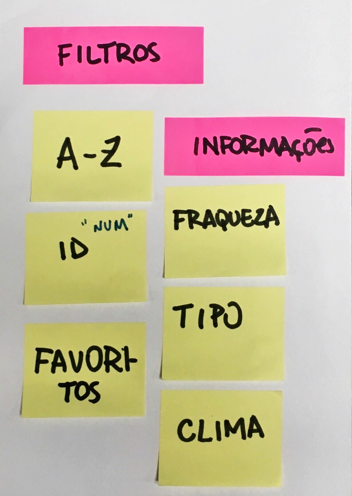
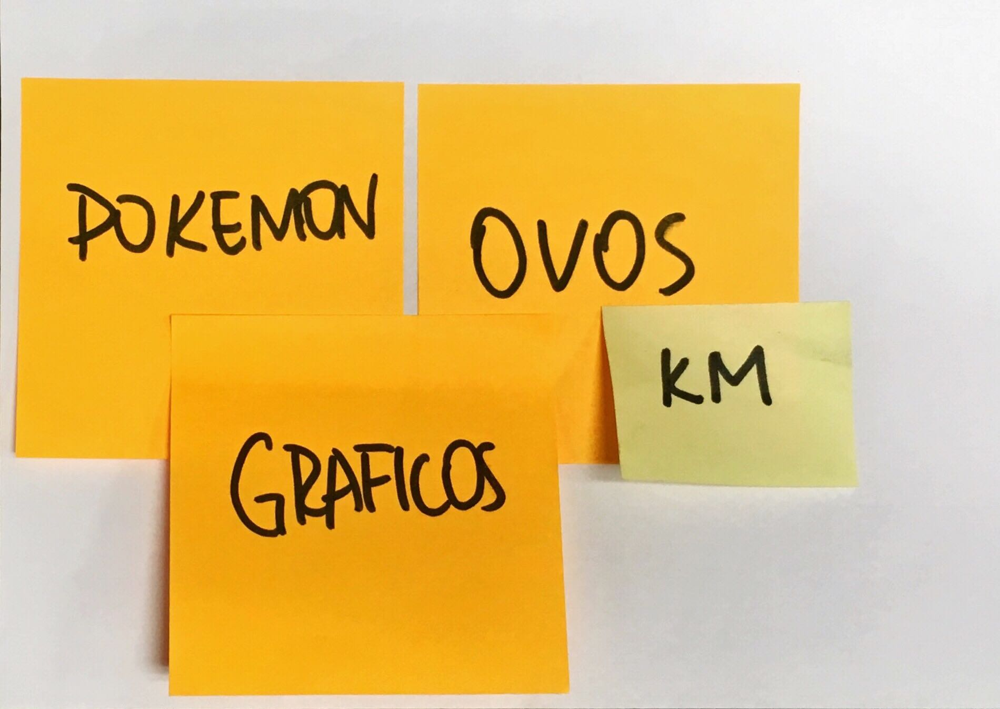

# Projeto Data Lovers
## Pokémon

## Índice

* [1. Introdução](#1-introdução)
* [2. Definição de produto](#2-definição-de-produto)
* [3. Histórias de usuário](#3-histórias-de-usuário)
* [4. Protótipo de baixa fidelidade](#4-protótipo-de-baixa-fidelidade)
* [5. Testes de usabilidade](#5-testes-de-usabilidade)

***

## 1. Introdução

O projeto Data Lovers é o segundo projeto proposto no bootcamp da Laboratória e baseia-se na criação de um produto (dashboard) a partir de uma base de dados. A base de dados escolhida foi do jogo Pokémon GO, em que há uma lista com os 151 Pokémons da região de Kanto, com suas respectivas estatísticas utilizadas no jogo.

## 2. Definição de produto

O desenho do produto foi feito a partir da identificação da ausência de algumas informações no jogo Pokémon GO que são importantes para que o usuário consiga elaborar melhores estratégias para ganhar batalhas pokémon. Assim, criamos uma interface em que o usuário poderá ter acesso à informações que podem auxiliá-lo a ganhar batalhas pokémon e a ter maiores chances de obter pokémons mais fortes. As informações são:
* Fraquezas.
* Lista de pokémons que nascem de ovos de acordo com a quilometragem (2 km, 5 km e 10 km) necessária para serem chocados.  

Os principais usuários desse produto seriam crianças, jovens e adultos que tenham interesse em jogar, ou que já jogam, Pokémon GO. Seus principais objetivos são buscar informações sobre os pokemóns de forma rápida, intuitiva e visual, a fim de obter sucesso em suas batalhas pokémon.
A interface pode ser utilizada enquanto o usuário está jogando ou em outros momentos, com a finalidade de pesquisa e elaboração de estratégias.

## 3. Histórias de usuário

* "Eu como usuário quero filtrar os pokémons por ordem alfabética".
Definição de pronto: Quando o usuário conseguir escolher ordenação de A a Z e de Z a A no dropdown e os cards de pokémons aparecerem na tela ordenados de acordo com a escolha.

* "Eu como usuário quero filtrar os pokémons pela Pokedéx".
Definição de pronto: Quando o usuário conseguir escolher ordenação de 1 a 151 e de 151 a 1 no dropdown e os cards de pokémons aparecerem na tela ordenados de acordo com a escolha.

* "Eu como usuário quero saber o tipo do pokémon".
Definição de pronto: Quando o usuário escolher os pokémons (ordenando, se necessário), clicando no card que traz a interface com a informação do tipo.

* "Eu como usuário quero saber as fraquezas do pokémon".
Definição de pronto: Quando o usuário escolher os pokémons (ordenando, se necessário), clicando no card que traz a interface com a informação das fraquezas.

* "Eu como usuário quero saber as chances de um ovo ser de determinado pokémon".
Definição de pronto: Quando o usuário clicar no botão de ovos de acordo com a quilometragem e aparecer uma lista de pokémons que nascem de ovos com a quilometragem escolhida.

## 4. Protótipo de baixa fidelidade

## 5. Testes de usabilidade

* Durante a execução do projeto, identificamos que não ficou claro para os usuários qual o objetivo do produto. Por isso, resolvemos acrescentar um pequeno texto na página inicial para esclarecer esse ponto.

* Também identificamos a dificuldade de voltar para a página anterior e para resolver esse problema, adicionamos um botão com a função de "voltar".

* Adicionamos o botão "voltar" no final da página, após a lista de todos os pokémons filtrados e identificamos que sua posição era um problema, já que o usuário teria de rolar a página inteira para chegar no botão ou até não perceber que o botão existe. A solução foi deixar o botão de "voltar" flutuando no canto inferior direito.
